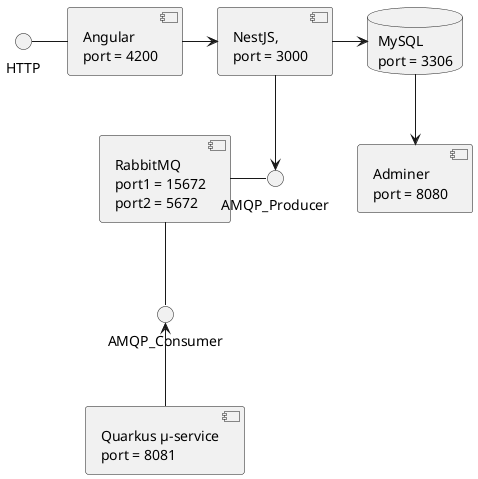

# Architecture logiciel : Micro servicer une application web
## Introduction
Le but de ce TP est de découper en micro-services le projet de web réalisé en parallèle. Dans ce TP, nous allons mettre ces micro-services dans des conteneurs Docker, les gérer et rajouter des services tel que RabbitMQ ou encore Quarkus. 

## Architecture de notre projet


### Explication
Nous sommes partie de notre projet web qui se composait d'un back-end,d'un front-end et d'une base de donnée. Le processus est simple : lorsque une requête est effectué elle attein d'abord le **front-end**, ensuite le front-end, lui, communique avec le **back-end** qui vient gérer les données. Le back-end vient donc dans notre architecture, communiquer avec **la base de donnée**, il communique également avec **Adminer** qui est un service similaire à **PhpMyAdmin** et permet de voir en temps réel l'état de nos table et leurs contenu. Enfin notre back-end communique avec **RabbitMq** au moyen d'une queue spéciifé. Enfin RabbitMq communique avec **Quarkus** pour lire les messages sur la queue et les envoyé par la suite par mail.


#### Compromis
* Utiliser adminer : Nous avons décidé d'utiliser Adminer car il était important pour nous de pouvoir voir les tables à tout moment ainsi que leur contenu. Nous avoins hésité à utiliser PhpMyAdmin mais celui-ci est beaucoup plus compliqué à mettre en place.
* Utiliser MySQL : Pour le SGBD nous avons utilisé MySQL car c'était un des SGBD que nous connaisions tout les 2 et qui était facile à mettre en place.
* Ne pas microsiser plus le back-end : Dans le plan de base, nous voulions prendre le back et le diviser en plusieurs micro-service. Cependant par manque de temps cela ne sait pas fait.

#### Architecture possible
* Utiliser PhpMyAdmin ou ne pas utiliser Adminer : Nous avons expliquer le choix avant, mais nous aurions pu avoir une architecture différente de celle que l'on a actuellement en remplacant Adminer par PhpMyAdmin ou bien en n'ayant rien à la place.
* Utiliser un autre SGBD : Nous avions plusieurs choix de SGBD disponible (PostgreSQL ou bien SQLlite par exemple). Là aussi l'architecture aurait pu être différente en remplacant le SGBD par celui utilisé.
* Micro-servicisé plus le back-end : En découpant notre back-end en plusieurs micro-service nous aurions pu avoir une architecture totalement différente et plus complexe.

### Liste des services
* Front-end : Interface utilisateur de notre projet web. **Statut : Validé**
* Back-end : Interface serveur de notre projet web. **Statut : Validé**
* Base de donnée : SGBD de notre projet web. **Statut : Validé**
* Adminer : Application web de gestion de base de données de notre projet web. **Statut : Validé**
* RabbitMq : Logiciel d'agent de messages de notre application. **Statut : Validé**
* Quarkus : Application Java qui gère l'envoie de mail de notre application web. **Statut : Mis en oeuvre**


### Configuration et utilisation
La configuration de l'architecture est fait de la sorte :
Nous avons un dossier pour le front, un pour le back et dernier pour Quarkus.
Chacun de ses dossiers contient un **Dockerfile** qui permet de lancer chaque service sur le bon port, avec les bonnes images et avec les bonne configurations. Exemple de dockerfile pour lancer nestJs :
```
FROM node:14 AS builder

# Create app directory
WORKDIR /user/src/app

# A wildcard is used to ensure both package.json AND package-lock.json are copied
COPY package*.json ./

# Install app dependencies
RUN npm install

COPY . .

RUN npm run build

FROM node:14

COPY --from=builder /user/src/app/node_modules ./node_modules
COPY --from=builder /user/src/app/package*.json ./
COPY --from=builder /user/src/app/dist ./dist

EXPOSE 3000
CMD [ "npm", "run", "start:prod" ]
```

Ensuite nous avons un fichier nommé **Docker Compose** qui regroupe tout les images et service de notre application. On y retrouve la configuration de certain service ainsi qu'un réseau dans lequel tout les services sont stocké. Dans ce fichier on y retrouve des configuration de certain service qui n'utilisent pas de dockerfile comme par exemple la base de données. Egalement lors de la dockerisation du backend et de la base de donnée, nous avons du modifier la configuration de **TypeOrm** dans notre back-end pour pouvoir assurer la connexion entre les 2.


Pour lancer l'application, il n'a pas de configuration nécessaire. Il suffit d'avoir docker d'installer sur sa machine. Ensuite il faut cloner le repository :
```
https://github.com/ghost-hikaru/Architecture_Logiciel.git
```
Ensuite il vous suffit jute de lancer la commande :
```
docker-compose build
```
La commande ci-dessus permet de build le projet en téléchargeant tout les images nécessaire.
Enfin il ne reste plus qu'à faire :
```
docker-compose up
```
Cela permet de lancer l'application avec tout les containers.
Si lorsque vous allez sur le front http://localhost:4200/, rien ne se passe, cela peut venir de votre navigateur. Nous vous conseillons d'utiliser le navigateur Google Chrome pour éviter tout problèmes.

Aucun mode spécifique n'a été ajouté pour cette architecture. Avec un plus de temps nous aurions rajouter un mode debug et également un mode développement pour faciliter l'integration des nouvelles features au sein du projet. De même par manque de temps, nous n'avons pas eu le temps de travail sur les ports précisément. En effet dans l'état actuel des choses, chaque contener écoute son propre port et fait ce qu'il a faire. Aucune amélioration pour réduire le nombre de port ainsi que de protégé les services non été faite. Mais c'est égalment un point que nous aurions voulu aborder.

### Analyse post-mortem
Nous aimerons soumettre une analyse du point de vue étudiant sur ce projet. Nous pensons avoir beaucoup appris sur la dockerisation de service/micro-service au sein de ce projet et de ces cours en général. De plus Docker est un outil intéressant et utile à aborder en école d'ingénieur. Surtout que si docker est un outil si utilisé en entreprise comme Git, il est important d'avoir des bases solides et de savoir l'utiliser correctement. Il faudrait cependant des Tp plus élaboré et être plus guidé. Ensuite nous estimons que la durée nécessaire pour réaliser le projet devrait être rallongé de quelques séances. De plus nous pensons qu’une introduction en cours à Docker (nous montrer à quoi ressemble Docker et comment l’utiliser avec des images/exemples concret) permettrait d’être plus efficace lors des TP initiaux que nous avions pas pu finir, ce qui nous a pénalisé lors du projet. 

## Conclusion
En conclusion, nous avons vu comment générer des Dockerfile afin de créer des conteneurs pour nos services, nous avons vu comment les mettre en communication via un DockerCompose. Nous avons également découvert les services RabbitMQ, Quarkus et Adminer.


