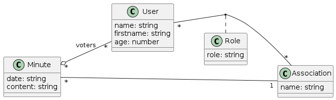

# Synthèse du projet coté serveur
## Introduction 
Le back-end désigne l'ensemble des composants d'un système informatique qui sont cachés aux utilisateurs et qui sont responsables de la gestion des tâches et des données en arrière-plan. Dans notre contexte, le back-end comprend les éléments suivants :

* Une base de données : ce système de gestion de données stocke et gèrent les informations utilisées par le site (utilisateurs, associations).
* Les modules : ces programmes exécutés sur les serveurs gèrent la logique métier du site (par exemple : gestion des utilisateurs, gestion des associations, etc.). 

### Les technologies du back-end
* Pour la réalisation du back-end nous utilisons un framework nommé **NestJs** qui se base sur le langage **TypeScript** qui lui-même se base sur le langage **JavaScript**. Ce framework permet de réaliser plus facilement nos applications coté serveur.
* Pour ce qui est de la base de données, nous avons décidés d'utiliser **MySql** et par ce fait de ne pas suivre le Tp en choissisant **SQLite**. Nous avons fait ce choix car lors de la découpe en micro-service de notre projet, il était plus simple d'utiliser MySql que SQLite. Bien que lors du projet nous utilisons **TypeORM**, cela n'a pas affecté le développement.
* Enfin, nous avons utilisé **PhpMyAdmin** qui est une application web de gestion de base de données. Celui-ci nous a permis de vérifier que nos tables SQL était bien créée et que les tables se remplissaient bien.

### L'architecture du back-end


Voici ci-dessus un diagramme de classe représentant les classes qui compose notre back-end ainsi que les liens entre elles. Notre application contiendra la gestion d'utilisateurs (classe user) mais également la gestion d'associations (classe association). Ayant de l'avance sur les tp nous avons décidés d'aller plus loin en réalisant la gestions des roles (classe roles) et des procès verbaux (classe minutes). Chaque classe est représentée par un module au sein du framework NestJs. Chaque module est ensuite consititué de :

* nomClasse.entity.ts : Ce fichier représente la classe avec les attributs qu'elles possèdent, également si une classe a une relation particulière avec une autre c'est dans celle-ci qu'on va la mettre.
* nomClasse.controller.ts : Dans ce fichier nous allons retrouver tout les endpoints pour chaque modules. Ce sont les points d'entrées que le front pourra utiliser pour communiquer avec le back. On y retrouvera des méthodes avec des **GET**,**POST**,**DELETE**,... A noter que dans ces fichiers, pour une bonne pratique, aucun appel à la base de donnée doit se faire.
* nomClasse.service.ts : C'est dans ces fichiers où toutes les opérations vont se faire (appel à la BDD, traitement des données,...)

On retrouvera également des modules particuliers comme le module **Auth** qui va permettre de gérer les connexions utilisateur à notre application. Le module d'authentification utilise **JWT** qui permet de générer un token unique pour se connecter.

Enfin on trouvera dans certains modules un fichier <class>Input.ts qui permet d'utiliser **l'API Swagger** qui donne une description/documentation de nos classes ainsi que des méthodes utilisées dans le controller.

### Les fonctionnalités du back-end :
Les utilisateurs représentent les acteurs principals de notre application. Chaque utilisateur aura son propre compte et pourra agir sur le reste de l'application une fois connecté. Voici les méthodes réalisées pour gérer les utlisateurs.
Pour les utlisateurs :
* Ajout/création d'un utilisteur
* Supression d'un utilisateur
* Modification d'un utilisateur
* GET tous les utilisateurs
* GET un utilistateur spécifique avec son id comme paramètre

Les associations sont de simples communications entre utilisateur. En effet une association est définie par un nom et un tableau d'utilisateurs. Voici les méthodes réalisées pour gérer les associations.
Pour les associations ;
* Ajout/création d'une association
* Supression d'une association
* Modification d'une association
* GET toutes les associations
* GET une association spécifique avec son id comme paramètre
* GET les utilisateurs d'une association spécifique

Un rôle représente un grade que pourrait avoir un utilisateur. Voici les méthodes réalisées pour gérer les rôles.
Pour les rôles :
* Ajout/création d'un rôle
* Supression d'un rôle
* Modification d'un rôle
* GET tous les rôles
* GET un rôle spécifique avec son id comme paramètre

Les procès verbaux sont des documents textes qui contiennent le compte rendu des assemblées générales des associations. Les associations doivent tenir une assemblée générale lors de leur création et une fois par an au moins. Voici les méthodes réalisées pour gérer les procès verbaux.
Pour les procès verbaux :
* Ajout/création d'un procès verbal
* Supression d'un procès verbal
* Modification d'un procès verbal
* GET tous les procès verbaux
* GET un procès verbal spécifique avec son id comme paramètre

Pour le module auth, on a une méthode de login utilisant **JWT**. De plus il faut noter que les mots de passe sont dans la base de donnée cryptée/hashée.

## Conclusion
Ce backend permet donc de gérer tous les calculs que l’on effectue pour le frontend. Les rôles et les minutes ont été implémenté mais ne sont pas utilisé dans le front, également pour le développement des rôles nous avons rencontré des problèmes de dépendance cyclique qui font que nous ne pouvons utiliser pleinement les classes rôles et minutes.


------------------------------------------------------------------------------------------------


## Installation

```bash
$ npm install
```

## Running the app

```bash
# development
$ npm run start

# watch mode
$ npm run start:dev

# production mode
$ npm run start:prod
```

## Test

```bash
# unit tests
$ npm run test

# e2e tests
$ npm run test:e2e

# test coverage
$ npm run test:cov
```

## Support

Nest is an MIT-licensed open source project. It can grow thanks to the sponsors and support by the amazing backers. If you'd like to join them, please [read more here](https://docs.nestjs.com/support).

## License

Nest is [MIT licensed](LICENSE).

## Contributeur
[Mathurin Melvin](melvin.mathurin@etudiant.univ-rennes1.fr),

[Voisin Enzo](enzo.voisin@etudiant.univ-rennes1.fr)

